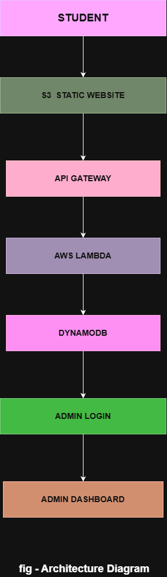
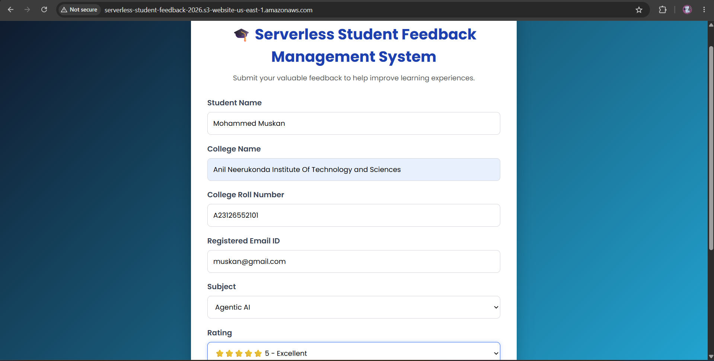
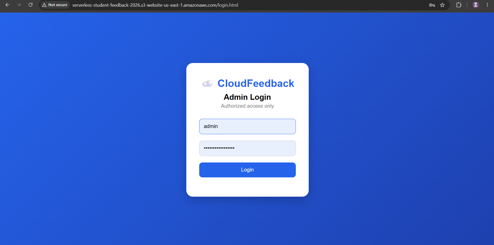
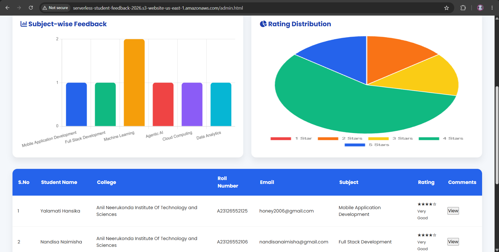

# 🎓 CloudFeedback - Serverless Student Feedback Management System

## 📌 Overview

CloudFeedback is a serverless web application developed using AWS cloud services to collect, manage, and analyze student feedback efficiently. The system enables students to submit course feedback through an interactive web interface while providing administrators with a secure dashboard to monitor and analyze responses.

The application follows a serverless architecture using AWS services, eliminating the need for server management while ensuring scalability, reliability, and cost efficiency.

---

## 🚀 Features

### Student Portal

* Submit feedback through an interactive web interface.
* Rate courses using a 5-star rating system.
* Provide comments and suggestions.
* Real-time feedback submission.

### Admin Dashboard

* Secure login authentication.
* View all submitted feedback.
* Search by student name.
* Filter by roll number, subject, and rating.
* Export feedback data to CSV.
* Interactive analytics dashboard.

### Analytics

* Total feedback count.
* Average rating calculation.
* Highest and lowest ratings.
* Subject-wise feedback analysis.
* Rating distribution visualization.

---

## ☁️ AWS Services Used

| AWS Service       | Purpose                |
| ----------------- | ---------------------- |
| Amazon S3         | Static website hosting |
| API Gateway       | REST API creation      |
| AWS Lambda        | Backend business logic |
| Amazon DynamoDB   | NoSQL database storage |
| Amazon CloudWatch | Monitoring and logging |

---

## 🛠️ Technology Stack

### Frontend
- HTML5
- CSS3
- JavaScript
- Chart.js
- Font Awesome

### Backend
- Python
- REST API

### Database
- Amazon DynamoDB

## ☁️ AWS Services Used

| AWS Service | Purpose |
|------------|---------|
| Amazon S3 | Static website hosting |
| Amazon API Gateway | REST API management |
| AWS Lambda | Serverless backend execution |
| Amazon DynamoDB | NoSQL database storage |
| Amazon CloudWatch | Monitoring and logging |

---

## 🏗️ System Architecture



### Workflow

1. Students submit feedback using the web application hosted on Amazon S3.
2. Amazon API Gateway receives the request.
3. API Gateway invokes the AWS Lambda function.
4. Lambda processes the request and stores feedback in DynamoDB.
5. The Admin Dashboard retrieves feedback using a GET API endpoint.
6. Analytics and visualizations are generated dynamically.

---

## 🔐 Authentication

The Admin Dashboard is protected using session-based authentication.

Only authenticated users can access feedback records and analytics.

## Live Demo

Student Feedback Form:
http://serverless-student-feedback-2026.s3-website-us-east-1.amazonaws.com/index.html

Admin Login:
http://serverless-student-feedback-2026.s3-website-us-east-1.amazonaws.com/login.html

Admin Dashboard (Protected)
Direct link:

http://serverless-student-feedback-2026.s3-website-us-east-1.amazonaws.com/admin.html

Expected behavior:
If logged in → Dashboard opens.
If not logged in → Automatically redirects to login.html

### Demo Credentials

Username: `admin`

Password: `cloudfeedback2026`

---

## 📊 Dashboard Features

* Dashboard analytics cards
* Subject-wise feedback bar chart
* Rating distribution pie chart
* Dynamic filtering and search
* CSV export functionality
* Responsive design
* Loading animations

---

## 📷 Screenshots

### Student Feedback Form



### Admin Login Page



### Admin Dashboard


### Analytics Dashboard



---

## 📂 Project Structure

```text
serverless-student-feedback-management-system/
│
├── backend/
│   ├── lambda_function.py
│   └── requirements.txt
│
├── frontend/
│   ├── index.html
│   ├── style.css
│   ├── script.js
│   ├── login.html
│   ├── login.css
│   ├── login.js
│   ├── admin.html
│   ├── admin.css
│   └── admin.js
│
├── docs/
│   ├── architecture.png
│   ├── report.pdf
│   └── screenshots/
│       ├── feedback_form.png
│       ├── admin_login.png
│       ├── dashboard.png
│       └── analytics.png
│
├── README.md

```

---

## ⚙️ Setup Instructions

### Clone the Repository

```bash
git clone https://github.com/your-username/serverless-student-feedback-management-system.git
```

### Configure AWS Resources

1. Create a DynamoDB table for storing feedback.
2. Create an AWS Lambda function.
3. Configure API Gateway with GET and POST endpoints.
4. Enable CORS in API Gateway.
5. Deploy frontend files using Amazon S3 Static Website Hosting.

---

## 📈 Future Enhancements

* JWT Authentication
* AWS Cognito Integration
* Email Notifications
* Sentiment Analysis using AI/ML
* Role-Based Access Control
* PDF Report Generation
* Email-based OTP Login

---

## 👥 Team Members

* Yenni Ravi Chandrika
* Yalamati Hansika
* Nandisa Naimisha
* Moyyi Hasini
* Mohammed Muskan
* Bandaru Srivalli

---

## 🎯 Learning Outcomes

* Serverless Architecture
* REST API Development
* AWS Cloud Services
* NoSQL Database Design
* Frontend Development
* Cloud Monitoring and Logging

---


##  Acknowledgements

* Amazon Web Services (AWS)
* Chart.js
* Font Awesome
* Open Source Community
